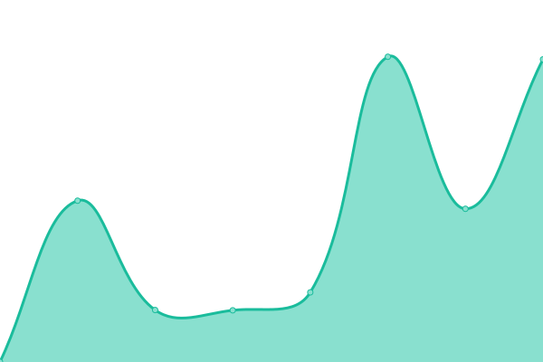

# [📈 Live Status](https://VideoScape.github.io/status): <!--live status--> **🟩 All systems operational**

This repository contains the open-source uptime monitor and status page for [VideoScape](https://VideoScape.github.io/status), powered by [Upptime](https://github.com/upptime/upptime).

With [Upptime](https://upptime.js.org), you can get your own unlimited and free uptime monitor and status page, powered entirely by a GitHub repository. We use [Issues](https://github.com/VideoScape/status/issues) as incident reports, [Actions](https://github.com/VideoScape/status/actions) as uptime monitors, and [Pages](https://VideoScape.github.io/status) for the status page.

<!--start: status pages-->
<!-- This summary is generated by Upptime (https://github.com/upptime/upptime) -->
<!-- Do not edit this manually, your changes will be overwritten -->
<!-- prettier-ignore -->
| URL | Status | History | Response Time | Uptime |
| --- | ------ | ------- | ------------- | ------ |
|  Plex | 🟩 Up | [plex.yml](https://github.com/VideoScape/status/commits/HEAD/history/plex.yml) | 

 2436ms
     
 | 

<a href="https://status.vsnet.uk/history/plex">99.32%</a>
    

|  [Support Site](https://help.vsnet.uk) | 🟩 Up | [support-site.yml](https://github.com/VideoScape/status/commits/HEAD/history/support-site.yml) | 

 645ms
     
 | 

<a href="https://status.vsnet.uk/history/support-site">100.00%</a>
    

|  Frontend | 🟩 Up | [frontend.yml](https://github.com/VideoScape/status/commits/HEAD/history/frontend.yml) | 

 220ms
     
 | 

<a href="https://status.vsnet.uk/history/frontend">99.33%</a>
    

|  Backend Control Panel | 🟩 Up | [backend-control-panel.yml](https://github.com/VideoScape/status/commits/HEAD/history/backend-control-panel.yml) | 

 1225ms
     
 | 

<a href="https://status.vsnet.uk/history/backend-control-panel">99.44%</a>
    

|  TV Backend | 🟩 Up | [tv-backend.yml](https://github.com/VideoScape/status/commits/HEAD/history/tv-backend.yml) | 

 789ms
     
 | 

<a href="https://status.vsnet.uk/history/tv-backend">99.45%</a>
    

|  Movie Backend | 🟩 Up | [movie-backend.yml](https://github.com/VideoScape/status/commits/HEAD/history/movie-backend.yml) | 

 1436ms
     
 | 

<a href="https://status.vsnet.uk/history/movie-backend">99.45%</a>
    

|  [Requester](https://request.vsnet.uk/login) | 🟩 Up | [requester.yml](https://github.com/VideoScape/status/commits/HEAD/history/requester.yml) | 

 2175ms
     
 | 

<a href="https://status.vsnet.uk/history/requester">99.35%</a>
    

|  Downloader Backend 1 | 🟩 Up | [downloader-backend-1.yml](https://github.com/VideoScape/status/commits/HEAD/history/downloader-backend-1.yml) | 

 1233ms
     
 | 

<a href="https://status.vsnet.uk/history/downloader-backend-1">99.35%</a>
    

|  Downloader Backend 2 | 🟩 Up | [downloader-backend-2.yml](https://github.com/VideoScape/status/commits/HEAD/history/downloader-backend-2.yml) | 

 790ms
     
 | 

<a href="https://status.vsnet.uk/history/downloader-backend-2">99.35%</a>
    

|  Indexer and VPN Service | 🟩 Up | [indexer-and-vpn-service.yml](https://github.com/VideoScape/status/commits/HEAD/history/indexer-and-vpn-service.yml) | 

 2127ms
     
 | 

<a href="https://status.vsnet.uk/history/indexer-and-vpn-service">99.36%</a>
    

|  Analytics Service | 🟩 Up | [analytics-service.yml](https://github.com/VideoScape/status/commits/HEAD/history/analytics-service.yml) | 

 471ms
     
 | 

<a href="https://status.vsnet.uk/history/analytics-service">100.00%</a>
    

<!--end: status pages-->

[**Visit our status website →**](https://VideoScape.github.io/status)

## 📄 License

- Powered by: [Upptime](https://github.com/upptime/upptime)
- Code: [MIT](./LICENSE) © [VideoScape](https://VideoScape.github.io/status)
- Data in the `./history` directory: [Open Database License](https://opendatacommons.org/licenses/odbl/1-0/)
